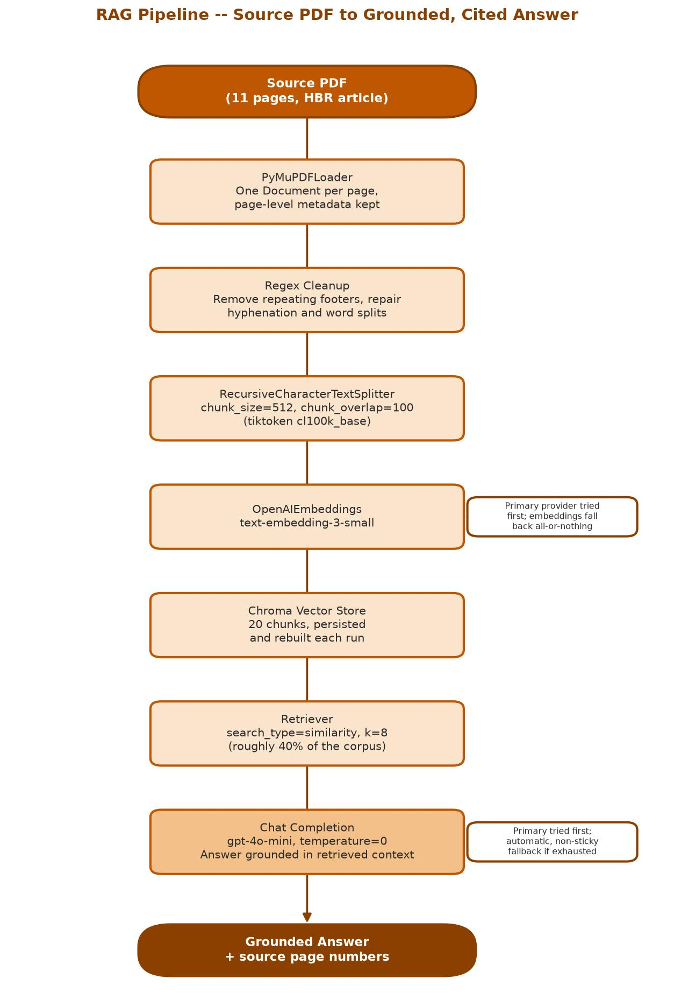
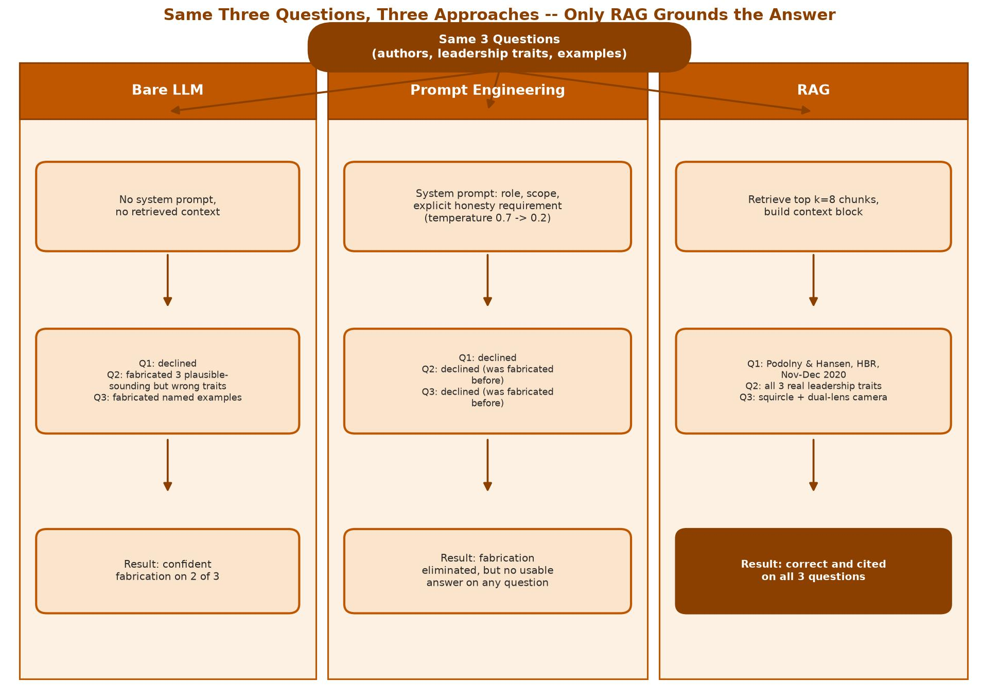

# Apple HBR RAG -- Retrieval-Augmented Generation for Business Document Q&A

##### UTA-PGP-AIABA: Agentic AI Foundations, Project 1 | Brock Frary | Published: 2026-09-21 | Updated: 2026-09-21

A dense 11-page Harvard Business Review article goes in; grounded, page-cited answers to three business questions come out -- produced three different ways (a bare LLM, a prompt-engineered LLM, and RAG) so the value of retrieval is visible through direct, run-and-compare evidence rather than asserted.


---

## Primary Project Artifacts

### [Notebook (.ipynb)](./Brock_Frary-PGP-AIABA-UTA-Sept26-Apple_HBR_RAG_Project_1.ipynb)

The source notebook -- code, prompts, and analysis, with real model outputs already saved in the cell outputs.

### [Reflection Document (.pdf)](./reflections.pdf)

The author's own retrospective -- project overview, architecture, design decisions, challenges and resolutions, trade-offs, and personal reflections, following the same structure as this README.

Also included: an [executed HTML export](./Brock_Frary-PGP-AIABA-UTA-Sept26-Apple_HBR_RAG_Project_1.html) of the notebook (the graded submission artifact, viewable in any browser with no setup).

---

*University of Texas at Austin -- Post Graduate Program in AI Agents for Business Applications (UTA-PGP-AIABA), September 2026 Cohort -- Module 1 Capstone*

> **Status:** Complete. Executed end to end in Google Colab with zero errors and zero warnings; all three question-answering approaches (bare LLM, prompt engineering, RAG) verified against real live-model outputs, not simulated. RAG correctly identifies the article's authors, publisher, and issue date (a fact neither of the other two approaches can produce), lists all three of the article's actual leadership characteristics, and cites two specific examples tied back to the leadership model -- every answer accompanied by the source page numbers it was drawn from.

## Overview

Business analysts lose time navigating long, information-dense reports. The scenario: an analyst at a venture capital firm is handed an 11-page Harvard Business Review article -- "How Apple Is Organized for Innovation" -- and needs specific answers out of it without reading the whole thing.

The notebook answers three questions three different ways, to make the value of retrieval visible rather than asserted:

| Approach | Grounded in the document? | Result |
|---|---|---|
| Bare LLM | No | Declined, or fabricated plausible-sounding but wrong content |
| Prompt-engineered LLM | No | Fabrication eliminated, but no usable answer on any question |
| RAG | Yes | Correct on all three questions, with page-level source attribution |

The authorship question -- "who wrote this article?" -- is the clearest demonstration. A model that has never read the document cannot answer it, and only RAG, given the article's own text, answers it correctly.

## Why this project (Situation)

A venture capital analyst evaluating a portfolio company against a dense business report needs answers that are both correct and checkable in seconds, not answers that merely sound confident. An ungrounded chat interface is not a shortcut for this kind of task -- it is a source of undetected errors, because a fabricated answer reads exactly as confident as a correct one. This project builds the evidence for that claim directly, rather than assuming it.

## Architecture

```
Source PDF
  -> PyMuPDFLoader
  -> regex cleanup (repeating footers, typesetting word-splits)
  -> RecursiveCharacterTextSplitter.from_tiktoken_encoder (cl100k_base)
  -> OpenAIEmbeddings
  -> Chroma vector store (persisted, rebuilt fresh every run)
  -> retriever (similarity, k=8)
  -> OpenAI-compatible chat completion
  -> grounded answer + source pages
```

| Parameter | Value | Reasoning |
|---|---:|---|
| `chunk_size` | 512 tokens | Short corpus (~5,300 words after cleanup); smaller chunks improve retrieval granularity |
| `chunk_overlap` | 100 tokens | ~20%, avoids splitting a leadership characteristic or example across a chunk boundary |
| `k` | 8 | Multi-fact questions need evidence from several pages; k=4 was tried first and proved too low for one question -- see Challenges below |
| `temperature` | 0 | Factual extraction; deterministic and reproducible |

**Figure A -- RAG Pipeline Architecture**



The full pipeline from the source PDF through cleanup, chunking, embedding, and retrieval, to a grounded answer with page citations. Both the embedding and chat completion calls follow the same primary-first, automatic-fallback provider strategy.

**Figure B -- Three-Way Comparison**



The same three questions run through all three approaches side by side. The model's raw capability never changed between runs -- what changed was whether it had the right information in front of it.

### A challenge worth naming: retrieval failure vs. synthesis failure

The RAG pipeline initially failed the question about specific innovation examples even after raising `k`. From the outside, a retrieval miss (the right chunk never fetched) and a synthesis failure (the right chunk fetched but the model not using it) look identical -- both come back as "the answer isn't there." Diagnosing this required inspecting the actual retrieved chunks directly: the right chunk was present in context, but the model still declined to connect it to the question. The fix combined `k=8` with a revised prompt that explicitly asks the model to bridge wording differences between the question and the source text -- raising `k` alone was necessary but not sufficient.

## Repository structure

```
.
├── README.md                                                         # this file
├── Brock_Frary-PGP-AIABA-UTA-Sept26-Apple_HBR_RAG_Project_1.html      # graded submission artifact (executed notebook)
├── Brock_Frary-PGP-AIABA-UTA-Sept26-Apple_HBR_RAG_Project_1.ipynb     # source notebook
├── reflections.pdf                                                    # author's own reflection document (not a course requirement)
└── diagrams/                                                          # architecture diagrams, embedded above
    ├── diagram_pipeline.jpg
    └── diagram_comparison.jpg
```

*(The source PDF is not included -- see "A note on the source material" below. `config.json`, credentials, and the local Python environment used to build this are not published, since this repo publishes only the finished artifacts.)*

## Prerequisites

To re-run the notebook yourself (rather than just reading the executed `.html`):

- Google Colab with a T4 GPU runtime (the API-based approach does not require GPU compute, but the runtime is kept aligned with the target deployment environment)
- An OpenAI-compatible API key (chat + embedding models)
- Your own copy of the source PDF -- see below

```
langchain==0.3.20
langchain-community==0.3.19
langchain-core==0.3.86
langchain-openai==0.3.9
langchain-chroma==0.2.6
chromadb==1.5.9
openai==1.66.3
tiktoken==0.14.0
pymupdf==1.28.2
matplotlib==3.11.2
```

## Deliverables

- [x] Executed notebook, exported to `.html` -- the graded submission artifact
- [x] Source `.ipynb`
- [x] Three-way question-answering comparison (bare LLM, prompt-engineered LLM, RAG), verified against real live-model outputs
- [x] RAG source attribution (page numbers) on every grounded answer
- [x] Two architecture diagrams (pipeline, three-way comparison)
- [x] Reflection document (`.pdf`) -- author's own artifact, not a course requirement

## A note on the source material

**The source document is not included in this repository.** The article used during development is Harvard Business Review material carrying an explicit notice that further posting, copying, or distribution is not permitted. The course-supplied notebook templates and presentation decks are likewise proprietary and are not included here.

Only original work is published in this repository: the notebook, its executed output, the diagrams, and this documentation. To run this against the original article, obtain it yourself and point the loader at your own copy. The pipeline is document-agnostic and works with any text-extractable PDF.

---

> © 2026 Brock Frary. All rights reserved.
